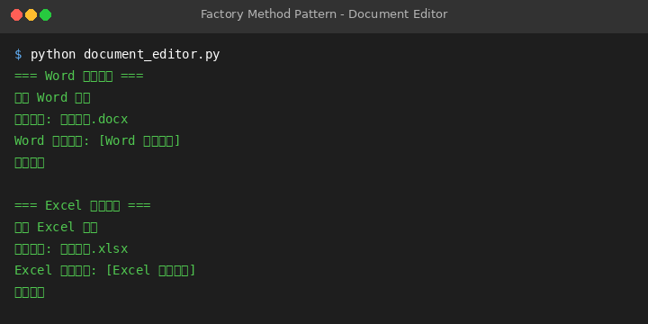

# Factory Method Pattern - Document Editor

## Pattern Overview

### Intent
Define an interface for creating an object, but let subclasses decide which class to instantiate. Factory Method lets a class defer instantiation to subclasses.

### Applicability
- When a class can't anticipate the class of objects it must create.
- When a class wants its subclasses to specify the objects it creates.
- When classes delegate responsibility to one of several helper subclasses, and you want to localize the knowledge of which helper subclass is the delegate.

### Key Participants
- **Product**: Defines the interface of objects the factory method creates.
- **ConcreteProduct**: Implements the Product interface.
- **Creator**: Declares the factory method, which returns an object of type Product. Creator may also define a default implementation of the factory method that returns a default ConcreteProduct object.
- **ConcreteCreator**: Overrides the factory method to return an instance of a ConcreteProduct.

## Example Scenario

This example uses a "Document Editor" scenario:
- Different applications (Word, Excel) create different types of documents.
- Application base class defines factory method, subclasses decide which specific document type to create.

Correspondence:
- `Document` → Product (product interface)
- `WordDocument`, `ExcelDocument` → ConcreteProduct (concrete products)
- `Application` → Creator (creator)
- `WordApplication`, `ExcelApplication` → ConcreteCreator (concrete creators)

## How to Run

### Requirements
- Python 3.10+

### Run the Code
```bash
python document_editor.py
```

### Expected Output
```
=== Word 应用程序 ===
创建 Word 文档
打开文档: 年度报告.docx
Word 文档内容: [Word 文档内容]
保存文档
=== Excel 应用程序 ===
创建 Excel 文档
打开文档: 销售数据.xlsx
Excel 文档内容: [Excel 表格数据]
保存文档
```

## Screenshot

